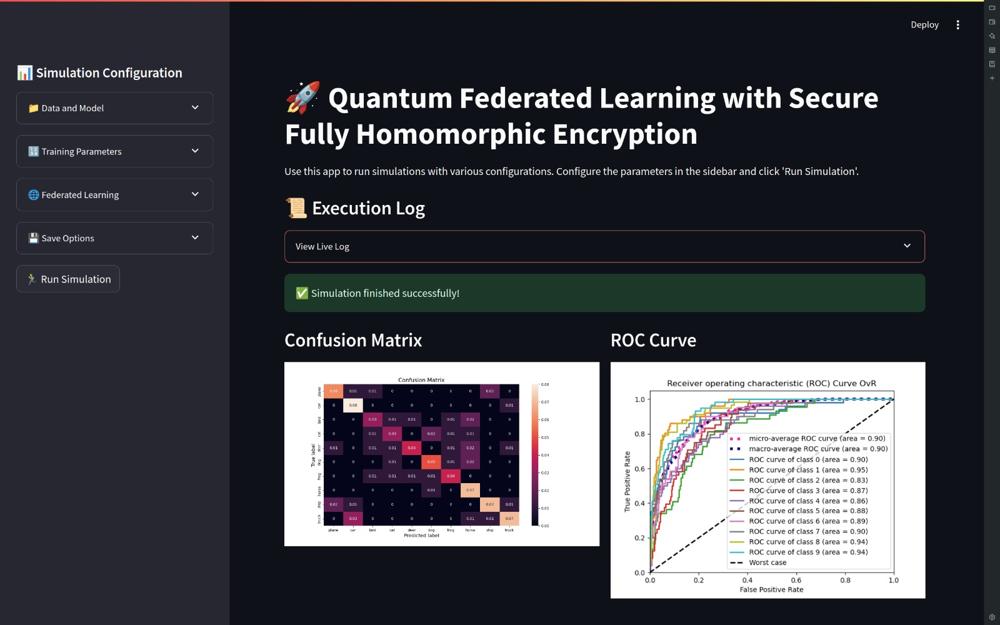

# MQFed+FHE: Multimodal Quantum Federated Learning with Secure Fully Homomorphic Encryption (FHE)


## Overview

Welcome to the Quantum Federated Learning (QFL) repository for our cutting-edge project, which utilizes Secure Fully Homomorphic Encryption (FHE). This initiative, developed for the QF 2024 Hackathon, seeks to advance privacy-preserving multimodal machine learning in quantum environments.

Quantum Federated Learning - Quantum Federated Learning (QFL) combines the principles of federated learning with the computational power of quantum computing. In a federated learning setup, multiple decentralized devices collaboratively train a model without sharing their local data. Each device trains the model on its own data and only shares the model updates. QFL takes this a step further by leveraging quantum computing to handle the complex computations involved in the training process, thereby improving efficiency and potentially unlocking new capabilities in machine learning. With Multimodality capabilities, the framework could handle multiple input modalities at once from various clients.

Secure Fully Homomorphic Encryption - Secure Fully Homomorphic Encryption (FHE) is a form of encryption that allows computations to be performed on encrypted data without needing to decrypt it first. This ensures that sensitive data remains private and secure even while being processed. By integrating FHE into the federated learning framework, we can ensure that model updates are encrypted throughout the entire process, maintaining privacy and security across all participants.

A technical paper is coming soon! - Link - {WIP}

The comprehensive results section can be seen:

| **Model**                                                                                  | **Num Rounds** | **Num Clients** | **Dataset Used**        | **FHE Activated** | **Central Validation Accuracy** | **Loss** | **Training Accuracy** | **Simulation Time**        |
|--------------------------------------------------------------------------------------------|---------------|-----------------|-------------------------|-------------------|-------------------------------|---------|-----------------------|---------------------------|
| [FHE-FedQNN-CIFAR](https://github.com/elucidator8918/QFML-QF-2024/blob/main/src/FHE_FedQNN_CIFAR.ipynb) | 20            | 10              | CIFAR-10                | Yes               | 70.12%                        | 1.24    | 99.1%                 | 9389.21 sec (156.5 min)   |
| [FHE-FedQNN-DNA](https://github.com/elucidator8918/QFML-QF-2024/blob/main/src/FHE_FedQNN_DNA.ipynb)   | 20            | 10              | Human DNA Sequence      | Yes               | 85.7%                         | 0.48    | 87.2%                 | 10822.34 sec (180.4 min)  |
| [FHE-FedQNN-MMF](https://github.com/elucidator8918/QFML-QF-2024/blob/main/src/FHE_FedQNN_MMF.ipynb)   | 20            | 10              | RAVDESS Multimodal          | Yes               | 67.43%                        | 0.93    | 94.53%                 | 1140.76 sec (19.1 min)   |
| [FHE-FedQNN-MRI](https://github.com/elucidator8918/QFML-QF-2024/blob/main/src/FHE_FedQNN_MRI.ipynb)   | 20            | 10              | Brain MRI Scan          | Yes               | 88.75%                        | 0.36    | 99.6%                 | 7309.01 sec (121.8 min)   |
| [FHE-FedQNN-PCOS](https://github.com/elucidator8918/QFML-QF-2024/blob/main/src/FHE_FedQNN_PCOS.ipynb)   | 20            | 10              | PCOS Binary          | Yes               | 70.15%                        | 1.09    | 100%                 | 5234.40 sec (87.2 min)   |
| [Standard-FedQNN-CIFAR](https://github.com/elucidator8918/QFML-QF-2024/blob/main/src/Standard_FedQNN_CIFAR.ipynb) | 20            | 10              | CIFAR-10                | No                | 72.16%                        | 1.202   | 97.15%                | 9090.41 sec (151.5 min)   |
| [Standard-FedQNN-DNA](https://github.com/elucidator8918/QFML-QF-2024/blob/main/src/Standard_FedQNN_DNA.ipynb)   | 20            | 10              | Human DNA Sequence      | No                | 84.2%                         | 0.43    | 85.5%                 | 10132.53 sec (168.9 min)  |
| [Standard-FedQNN-MMF](https://github.com/elucidator8918/QFML-QF-2024/blob/main/src/Standard_FedQNN_MMF.ipynb)   | 20            | 10              | RAVDESS Multimodal          | No                | 70.83%                        | 0.83   | 95.3%                  | 1013.91 sec (16.9 min)   |
| [Standard-FedQNN-MRI](https://github.com/elucidator8918/QFML-QF-2024/blob/main/src/Standard_FedQNN_MRI.ipynb)   | 20            | 10              | Brain MRI Scan          | No                | 89.71%                        | 0.338   | 100%                  | 7537.57 sec (125.6 min)   |
| [Standard-FedQNN-PCOS](https://github.com/elucidator8918/QFML-QF-2024/blob/main/src/Standard_FedQNN_PCOS.ipynb)   | 20            | 10              | PCOS Binary          | No                | 66.19%                        | 0.611   | 100%                  | 4200.41 sec (70.9 min)   |

## Repository Structure

```
.
├── assets/
├── dashboard_src/
│   ├── dashboard_utils/
│   └── utils/
├── Flower/
├── src/
│   ├── utils/
│   ├── FHE_FedQNN_CIFAR.ipynb
│   ├── FHE_FedQNN_DNA.ipynb
│   ├── FHE_FedQNN_MMF.ipynb
│   ├── FHE_FedQNN_MRI.ipynb
│   ├── FHE_FedQNN_PCOS.ipynb
│   ├── Standard_FedQNN_CIFAR.ipynb
│   ├── Standard_FedQNN_DNA.ipynb
│   ├── Standard_FedQNN_MMF.ipynb
│   ├── Standard_FedQNN_MRI.ipynb
│   └── Standard_FedQNN_PCOS.ipynb
├── dashboard.py
├── run-cpu.sh
├── run-gpu.sh
├── .gitignore
└── README.md
```

## Installation

### Clone the Repository

```bash
git clone https://github.com/elucidator8918/QFML-QF-2024.git
cd QFML-QF-2024
```

### Install Dependencies

#### For CPU

```bash
conda create -n fed python=3.10.12 anaconda
conda init
conda activate fed
bash run-cpu.sh
```

#### For GPU

```bash
conda create -n fed python=3.10.12 anaconda
conda init
conda activate fed
bash run-gpu.sh
```

## Usage

To use the quantum federated dashboard to view and run simulations, execute the following command:

```python
streamlit run dashboard.py
```




### Running Experiments

Choose the appropriate notebook based on your dataset and encryption preference:

#### FHE-enabled Quantum Federated Learning

- **CIFAR-10 Dataset:**
  - Notebook: `src/FHE_FedQNN_CIFAR.ipynb`
  - Description: CIFAR-10 consists of 60,000 32x32 color images in 10 classes, with 6,000 images per class. It is widely used for image classification tasks.

- **DNA Sequence Dataset:**
  - Notebook: `src/FHE_FedQNN_DNA.ipynb`
  - Description: This dataset includes DNA sequences used for various biological and genetic studies, focusing on sequence classification and pattern recognition.

- **MRI Scan Dataset:**
  - Notebook: `src/FHE_FedQNN_MRI.ipynb`
  - Description: This dataset contains MRI scans used for medical image analysis, particularly for detecting and diagnosing conditions based on scan data.

- **PCOS Dataset:**
  - **Notebook:** `src/FHE_FedQNN_PCOS.ipynb`
  - **Description:** This dataset is used for analyzing Polycystic Ovary Syndrome (PCOS). It is employed for developing and assessing models aimed at detecting and diagnosing PCOS based on this data.

- **RAVDESS Multimodal Dataset:**
  - **Notebook:** `src/FHE_FedQNN_MMF.ipynb`
  - **Description:** This dataset includes audio and visual recordings from the RAVDESS (Ryerson Audio-Visual Database of Emotional Speech and Song) project. It is used for multimodal emotion recognition and analysis, leveraging both audio and video data to develop and evaluate models for detecting and interpreting emotional expressions. 

#### Standard Quantum Federated Learning

- **CIFAR-10 Dataset:**
  - Notebook: `src/Standard_FedQNN_CIFAR.ipynb`
  - Description: The same CIFAR-10 dataset, utilized without the FHE layer, for benchmarking and comparison.

- **DNA Sequence Dataset:**
  - Notebook: `src/Standard_FedQNN_DNA.ipynb`
  - Description: The same DNA sequence dataset, used without FHE for standard federated learning experiments.

- **MRI Scan Dataset:**
  - Notebook: `src/Standard_FedQNN_MRI.ipynb`
  - Description: The same MRI scan dataset, used without FHE to evaluate the performance of standard federated learning models.

- **PCOS Dataset:**
  - **Notebook:** `src/Standard_FedQNN_PCOS.ipynb`
  - **Description:** The same PCOS dataset, used without FHE to evaluate the performance of standard federated learning models.

- **RAVDESS Multimodal Dataset:**
  - **Notebook:** `src/Standard_FedQNN_MMF.ipynb`
  - **Description:** The same RAVDESS dataset, used without FHE to evaluate the performance of standard federated learning models. 

## License

This project is licensed under the MIT License. See the [LICENSE](./LICENSE) file for details.

## Acknowledgments

- Thank you to the QF 2024 Hackathon organizers for providing us with this opportunity.

## Contact

For inquiries, please reach out to Team DuoLicht at:
- forsomethingnewsid@gmail.com
- pavana.karanth17@gmail.com
